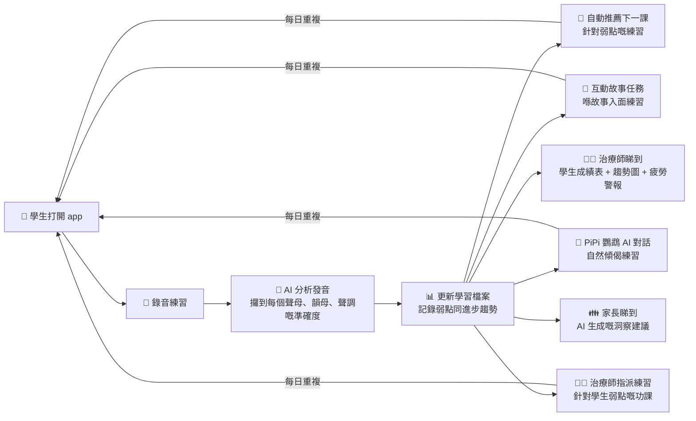

# SpeakAble HK — How It Works

## Who Uses SpeakAble?

👶 **學生 (Student/Explorer)** — 每日練習廣東話發音
👨‍⚕️ **治療師 (Therapist)** — 管理學生進度、設計練習、俾語音榜樣
👪 **家長 (Parent)** — 睇住小朋友嘅練習報告同 AI 建議

---

## The Main Flow



## 三個入口

```
/auth ─┬─ 👶 學生 → /dashboard
       ├─ 👨‍⚕️ 治療師 → /therapist-portal
       └─ 👪 家長 → /parent-dashboard
```

## 治療師點樣幫學生練習？

```
👨‍⚕️ 治療師 Portal (/therapist-portal)
│
├── 1️⃣ 連結學生
│     打開個案管理 → 加學生 → 以後可以睇到佢哋嘅進度
│
├── 2️⃣ 聲線校準（Calibration）
│     治療師錄一次標準發音 → AI 記住「呢個係正確版」
│     → 以後學生練習時，AI 用治療師嘅標準做基準
│     → 校準記錄會儲起，隨時可以睇返
│
├── 3️⃣ 治療師聲線克隆（Therapist Voice Clone）
│     治療師錄低句子 → AI 克隆治療師把聲
│     → 學生練習時，聽到嘅係「自己治療師把聲」讀標準發音
│     → 唔係機械人聲，係熟悉嘅治療師聲音，學生更投入
│
├── 4️⃣ 指派練習功課
│     揀學生 → 揀發音類別（如 /n/ vs /l/）
│     → 學生打開 app 就會見到「治療師俾你嘅練習」
│     → 做完嘅功課會自動回報俾治療師
│
├── 5️⃣ 睇趨勢數據
│     每個學生嘅發音趨勢圖（逐個音睇）
│     ├── 📈 準確率隨時間變化（今個月 vs 上個月）
│     ├── 🔴 最弱嘅 3 個音（需要 focus）
│     ├── 🟢 進步最快嘅 3 個音（值得鼓勵）
│     ├── ⚠️ 疲勞檢測（練習超過幾耐開始跌 accuracy）
│     └── 📊 與其他學生嘅基準比較
│
└── 6️⃣ 自訂遊戲
      幫學生整迷你遊戲，針對佢哋嘅弱點發音
```

## 練習時發生咩事？

```
🎤 學生講嘢
    ↓
🤖 Hon9Kon9ize 聽你講乜（廣東話語音辨識）
    ↓
🔍 拆開每個音：聲母、韻母、聲調
    ↓
🧠 NEPA 世界模型記錄你嘅弱點
    ↓
📚 自動出下一課（針對你最弱嘅音）
    ↓
🔊 AI 聲線克隆 — 你講完，AI 用你把聲讀返標準發音
      你聽返自己把聲講正確版本，大腦學得更快！
```

## 互動故事冒險

```
📖 Aura Journey (/aura-journey) — 互動語音故事
├── 🎬 每個場景有劇情 + 錄音任務
├── 🎤 你要讀故事入面嘅對白
├── 🤖 AI 即時比分 + 發音回饋
├── 🔓 完成任務解鎖下一章
└── 🏆 儲 XP、拎獎盃、睇自己進步

🌳 Enchanted Forest (/enchanted-forest)
├── 🎮 3D 森林冒險地圖
├── 🗺️ 每個地點對應一組發音練習
├── 🐸 捉飛蟲、忍者生果、迷宮等迷你遊戲
└── 🎯 遊戲中練習目標發音

🦜 PiPi 鸚鵡 (/pipi)
├── 💬 AI 對話機械人（用廣東話傾偈）
├── 🎤 你講嘢，PiPi 回應
├── 😄 輕鬆冇壓力，好似同朋友傾偈
└── 📝 不知不覺練習發音
```

## AI 聲線克隆（Voice Clone）

```
你錄音講「我今日好開心」
    ↓
AI 分析你把聲嘅特質（音色、高低、節奏）
    ↓
AI 用「你把聲」讀出標準發音版本
    ↓
🔊 播返俾你聽：「你用自己把聲講到標準喇！」
    ↓
🧠 大腦對比自己講嘅 vs 標準版 → 學得快好多
```

**治療師聲線克隆（更勁）：**
```
治療師錄一次：「你嘅目標係讀準 /n/ 音」
    ↓
AI 克隆治療師把聲
    ↓
學生練習時聽到：「你嘅目標係讀準 /n/ 音」— 係治療師把聲！
    ↓
學生同治療師嘅連結更強 → 更有動力練習
```

**點解咁勁？** 傳統語言 app 只係話你知「錯」，但唔話你知「點先啱」。Voice clone 俾你聽返「自己把聲講標準版」，大腦直接記住個正確發音，唔使靠估。治療師版更加有親切感。

## 治療師 Portal 完整功能

```
/st-dashboard     — 世界模型 + 儀錶板 + 趨勢圖
/st-nepa          — NEPA 神經網絡分析（逐個音嘅混淆矩陣）
/st-game-builder  — 自訂 mini game 俾學生
/st-accounts      — 個案管理（加/刪學生，連結）
/st-settings      — 校準管理 + 聲線克隆設定
/therapist-portal — 入口，整合以上所有功能
```

## 家長睇到咩？

```
家長專區 (/parent-dashboard)
├── 👶 已連結嘅小朋友列表
├── 📊 練習統計（總練習、完成率、準確度、經驗值）
├── 🤖 AI 洞察（OpenRouter AI 生成嘅廣東話建議）
│   ├── 👍 做得好嘅地方
│   ├── 📈 可以改善嘅地方
│   └── 💡 家長小貼士
└── 💳 帳單管理（月費計劃）
```

## 每日程式係點行？

```
👶 學生：
起床 → 打開 app → 做 10 分鐘練習 / 故事任務 / PiPi 對話
                                  ↓
                        AI 記錄進度、更新世界模型
                                  ↓
                        治療師睇 dashboard（每星期）
                        家長睇 AI 洞察（隨時）
                                  ↓
                        聽日 app 自動推薦最適合你嘅練習

👨‍⚕️ 治療師：
上晝 — 睇學生趨勢圖 → 標記需要關注嘅學生
下晝 — 錄 calibration → 指派練習俾學生
收工 — 檢查學生做完嘅功課回報

👪 家長：
打開 app → 睇小朋友今日練咗幾多
       → AI 洞察俾建議
       → 知道自己可以點幫手
```

## Backend 有咩行緊？

| 服務 | Port | 做咩 |
|------|------|------|
| 🏠 Speakable Core | `:8100` | 主要 API — 世界模型、儀錶板、練習推薦、校準 |
| 🗣️ Hon9Kon9ize | `:8200` | 廣東話語音辨識 |
| 🌉 Speakable Bridge | `:8300` | 路由代理 |
| 📨 NATS | `:4222` | 訊息傳遞 |
| ☁️ Supabase | Cloud | 用戶認證、資料庫、Edge Functions、聲線克隆 |
