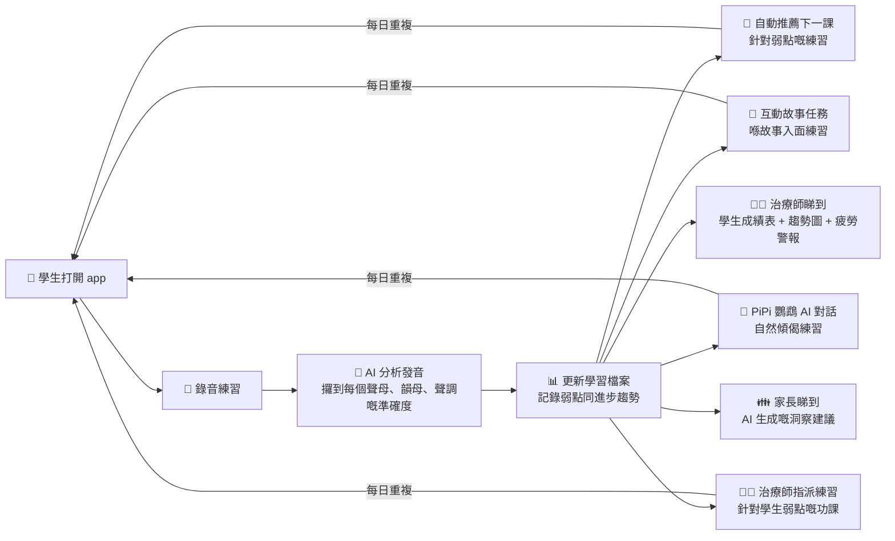

# SpeakAble HK — Architecture & Development Roadmap

## Current Development Phase

We are now in **two parallel development tracks**:

### 🚀 Speakable Enhancement (P1-P3 Focus)
Core user-facing features that directly impact students, parents, and the Aura Journey experience.

### 🔧 Speakable Improvement
Backend infrastructure, therapist tools, and NEPA analytics platform.

---

## Who Uses SpeakAble?

👶 **學生 (Student/Explorer)** — 每日練習廣東話發音
👨‍⚕️ **治療師 (Therapist)** — 管理學生進度、設計練習、俾語音榜樣
👪 **家長 (Parent)** — 睇住小朋友嘅練習報告同 AI 建議

---

## Codebase Structure

```
src/
├── enhancement/              # 🚀 SPEAKABLE ENHANCEMENT (P1-P3)
│   ├── student-portal/       # P1: Student Portal (Explorer)
│   │   ├── pages/            # Dashboard, Exercise, Progress, TreasureMap, PiPi, etc.
│   │   └── components/       # TreasureMap, Quest*, RewardsShop, PiPi*, EnchantedForest*, MiniGames
│   ├── parent-portal/        # P2: Parent Portal
│   │   ├── pages/            # ParentDashboardPage
│   │   └── components/       # parentPortal/
│   └── aura-journey/         # P3: AuraJourney + Syali Studio (merged)
│       ├── AuraJourneyPage.tsx
│       ├── AuraStoryPage.tsx
│       ├── EnchantedForestPage.tsx
│       └── components/       # auraJourney/, SyaliStudio.tsx, VoiceCloning
│
├── improvement/              # 🔧 SPEAKABLE IMPROVEMENT
│   ├── therapist-portal/     # Therapist Portal
│   │   ├── pages/            # TherapistPortalPage, STDashboard, STAccounts, STSettings
│   │   └── components/       # therapistPortal/, STLayout, TherapistCalibrationSection
│   └── nepa-portal/          # NEPA Portal
│       ├── pages/            # NEPADashboardPage, MiniGameBuilderPage
│       └── components/       # nepaBackendSync.ts (Supabase integration)
│
└── shared/                   # 📦 SHARED RESOURCES
    ├── components/           # UI components, layouts, ProtectedRoute, BilabialStation*, etc.
    ├── pages/                # Landing, Auth, Onboarding, Pricing, Index, etc.
    ├── hooks/                # All hooks (useAuth, useRole, useToast, usePronunciationAPI, etc.)
    ├── lib/                  # Utilities, stores, miniGameBuilder/, storyverse/
    ├── contexts/             # LanguageContext, AccessibilityContext
    ├── i18n/                 # Translations (en, zh-HK, zh-CN)
    ├── types/                # TypeScript types
    ├── styles/               # CSS files
    └── utils/                # Helper functions
```

---

## 🚀 Enhancement Track (P1-P3)

### P1: Student Portal (`/enhancement/student-portal`)
**Status: ✅ Active Development**

**Routes:**
- `/dashboard` — Main student dashboard with minigames, practice islands, road map
- `/practice/:exerciseId` — Individual practice sessions
- `/progress` — Student progress tracking
- `/treasure-map` — 3D treasure map with jumping animation
- `/pirate-treasure-map` — Pirate-themed 3D learning map
- `/echo-speech` — Voice cloning practice
- `/lesson/:lessonId` — Structured lessons
- `/semantic-island` — Semantic learning island
- `/pipi` — PiPi parrot AI chatbot
- `/settings` — Student settings

**Key Features:**
- ✅ Minigames display on dashboard (7 games: 3 quiz + 4 adaptation)
- ✅ 3D TreasureMap with PiPi jumping animation between checkpoints
- ✅ Voice cloning with start/stop recording + ASR phoneme feedback
- ✅ Practice islands (bilabial, alveolar) with progressive difficulty
- ✅ Road map visualization showing learning progress
- ✅ Practice sidebar with real-time feedback

**Recent Changes:**
- Added dedicated "迷你遊戲" section to dashboard showing all 7 minigames
- Enhanced voice cloning with proper start/stop buttons, duration timer, phoneme-level confidence scores
- Integrated NEPA backend sync for student progress persistence

---

### P2: Parent Portal (`/enhancement/parent-portal`)
**Status: ✅ Implemented**

**Routes:**
- `/parent-dashboard` — Parent dashboard with AI insights

**Key Features:**
- ✅ Linked children list
- ✅ Practice statistics (total practice, completion rate, accuracy, XP)
- ✅ AI insights (OpenRouter AI-generated Cantonese suggestions)
  - 👍 What they did well
  - 📈 Areas for improvement
  - 💡 Parent tips
- ✅ Billing management (monthly plans)

---

### P3: Aura Journey + Syali Studio (`/enhancement/aura-journey`)
**Status: ✅ Active Development**

**Routes:**
- `/aura-journey` — Interactive voice story journey
- `/aura-story` — Aura story interactive forest
- `/enchanted-forest` — 3D forest adventure map

**Key Features:**
- ✅ Syali Studio merged into Aura Journey
- ✅ Voice cloning with ASR feedback (phoneme-level analysis)
- ✅ 12-chapter cinematic Cantonese practice
- ✅ Each scene has storyline + recording tasks
- ✅ AI instant scoring + pronunciation feedback
- ✅ Unlock next chapter by completing tasks
- ✅ XP collection, trophies, progress tracking

**Voice Cloning Flow:**
```
🎤 Student records "我今日好開心"
    ↓
🤖 AI analyzes voice characteristics (timbre, pitch, rhythm)
    ↓
🔊 AI plays back standard pronunciation using student's voice
    ↓
🧠 Brain compares own speech vs standard → learns faster!
```

---

## 🔧 Improvement Track

### Therapist Portal (`/improvement/therapist-portal`)
**Status: ✅ Implemented**

**Routes:**
- `/therapist-portal` — Main therapist portal entry
- `/st-dashboard` — World model + dashboard + trend charts
- `/st-nepa` — NEPA neural network analysis (phoneme confusion matrix)
- `/st-game-builder` — Custom mini games for students
- `/st-accounts` — Case management (add/remove students, link)
- `/st-settings` — Calibration management + voice clone settings

**Key Features:**
- ✅ Link students
- ✅ Voice calibration (record standard pronunciation → AI uses as baseline)
- ✅ Therapist voice clone (students hear therapist's voice, not robot voice)
- ✅ Assign practice homework
- ✅ View trend data (accuracy over time, weakest 3 phonemes, fastest improving 3, fatigue detection, peer comparison)
- ✅ Custom game builder

---

### NEPA Portal (`/improvement/nepa-portal`)
**Status: ✅ Implemented + Supabase Sync**

**Routes:**
- `/st-nepa` — NEPA dashboard (accessible via therapist portal)
- `/st-game-builder` — Mini game builder

**Key Features:**
- ✅ NEPA neural network analysis
- ✅ Phoneme-level confusion matrix
- ✅ Fatigue detection (STDP model)
- ✅ Trend sparklines for each phoneme
- ✅ Supabase backend sync (student_progress, phoneme_results, nepa_summaries tables)
- ✅ Fallback to localStorage if Supabase not configured

**Recent Changes:**
- Added `nepaBackendSync.ts` for Supabase integration
- Auto-syncs NEPA summary when student data loads
- Sync indicator shows syncing/synced/error states

---

## The Main Flow



## 三個入口

```
/auth ─┬─ 👶 學生 → /dashboard
       ├─ 👨‍⚕️ 治療師 → /therapist-portal
       └─ 👪 家長 → /parent-dashboard
```

## 治療師點樣幫學生練習？

```
👨‍⚕️ 治療師 Portal (/therapist-portal)
│
├── 1️⃣ 連結學生
│     打開個案管理 → 加學生 → 以後可以睇到佢哋嘅進度
│
├── 2️⃣ 聲線校準（Calibration）
│     治療師錄一次標準發音 → AI 記住「呢個係正確版」
│     → 以後學生練習時，AI 用治療師嘅標準做基準
│     → 校準記錄會儲起，隨時可以睇返
│
├── 3️⃣ 治療師聲線克隆（Therapist Voice Clone）
│     治療師錄低句子 → AI 克隆治療師把聲
│     → 學生練習時，聽到嘅係「自己治療師把聲」讀標準發音
│     → 唔係機械人聲，係熟悉嘅治療師聲音，學生更投入
│
├── 4️⃣ 指派練習功課
│     揀學生 → 揀發音類別（如 /n/ vs /l/）
│     → 學生打開 app 就會見到「治療師俾你嘅練習」
│     → 做完嘅功課會自動回報俾治療師
│
├── 5️⃣ 睇趨勢數據
│     每個學生嘅發音趨勢圖（逐個音睇）
│     ├── 📈 準確率隨時間變化（今個月 vs 上個月）
│     ├── 🔴 最弱嘅 3 個音（需要 focus）
│     ├── 🟢 進步最快嘅 3 個音（值得鼓勵）
│     ├── ⚠️ 疲勞檢測（練習超過幾耐開始跌 accuracy）
│     └── 📊 與其他學生嘅基準比較
│
└── 6️⃣ 自訂遊戲
      幫學生整迷你遊戲，針對佢哋嘅弱點發音
```

## 練習時發生咩事？

```
🎤 學生講嘢
    ↓
🤖 Hon9Kon9ize 聽你講乜（廣東話語音辨識）
    ↓
🔍 拆開每個音：聲母、韻母、聲調
    ↓
🧠 NEPA 世界模型記錄你嘅弱點
    ↓
📚 自動出下一課（針對你最弱嘅音）
    ↓
🔊 AI 聲線克隆 — 你講完，AI 用你把聲讀返標準發音
      你聽返自己把聲講正確版本，大腦學得更快！
```

## AI 聲線克隆（Voice Clone）

```
你錄音講「我今日好開心」
    ↓
AI 分析你把聲嘅特質（音色、高低、節奏）
    ↓
AI 用「你把聲」讀出標準發音版本
    ↓
🔊 播返俾你聽：「你用自己把聲講到標準喇！」
    ↓
🧠 大腦對比自己講嘅 vs 標準版 → 學得快好多
```

**治療師聲線克隆（更勁）：**
```
治療師錄一次：「你嘅目標係讀準 /n/ 音」
    ↓
AI 克隆治療師把聲
    ↓
學生練習時聽到：「你嘅目標係讀準 /n/ 音」— 係治療師把聲！
    ↓
學生同治療師嘅連結更強 → 更有動力練習
```

**點解咁勁？** 傳統語言 app 只係話你知「錯」，但唔話你知「點先啱」。Voice clone 俾你聽返「自己把聲講標準版」，大腦直接記住個正確發音，唔使靠估。治療師版更加有親切感。

## 每日程式係點行？

```
👶 學生：
起床 → 打開 app → 做 10 分鐘練習 / 故事任務 / PiPi 對話
                                  ↓
                        AI 記錄進度、更新世界模型
                                  ↓
                        治療師睇 dashboard（每星期）
                        家長睇 AI 洞察（隨時）
                                  ↓
                        聽日 app 自動推薦最適合你嘅練習

👨‍⚕️ 治療師：
上晝 — 睇學生趨勢圖 → 標記需要關注嘅學生
下晝 — 錄 calibration → 指派練習俾學生
收工 — 檢查學生做完嘅功課回報

👪 家長：
打開 app → 睇小朋友今日練咗幾多
       → AI 洞察俾建議
       → 知道自己可以點幫手
```

## Backend 有咩行緊？

| 服務 | Port | 做咩 |
|------|------|------|
| 🏠 Speakable Core | `:8100` | 主要 API — 世界模型、儀錶板、練習推薦、校準 |
| 🗣️ Hon9Kon9ize | `:8200` | 廣東話語音辨識 |
| 🌉 Speakable Bridge | `:8300` | 路由代理 |
| 📨 NATS | `:4222` | 訊息傳遞 |
| ☁️ Supabase | Cloud | 用戶認證、資料庫、Edge Functions、聲線克隆 |

## Deployment

**Live at:** https://app.speakable.hk
**Server:** 76.13.218.52
**Stack:** Docker Compose (speakable frontend + Caddy for HTTPS/TLS)

**Deployment Commands:**
```bash
# Pull latest code
ssh root@76.13.218.52 "cd /var/www/speakable && git pull origin main"

# Rebuild and deploy
ssh root@76.13.218.52 "cd /var/www/speakable && docker compose down && docker compose up -d --build"
```

---

## Development Priorities

### Current Focus: Enhancement P1-P3
1. ✅ Voice cloning with ASR feedback (start/stop buttons, phoneme analysis)
2. ✅ Minigames display on student dashboard
3. ✅ 3D TreasureMap with jumping animation
4. ✅ NEPA backend Supabase sync
5. 🔄 Student portal UX improvements
6. 🔄 Parent portal AI insights enhancement
7. 🔄 Aura Journey chapter progression

### Next Up: Improvement Track
1. Therapist voice clone workflow optimization
2. NEPA confusion matrix visualization
3. Student-therapist linking improvements
4. Game builder enhancement

---

*Last Updated: 2026-06-12*
*Version: 2.0 (Enhancement/Improvement Split)*
